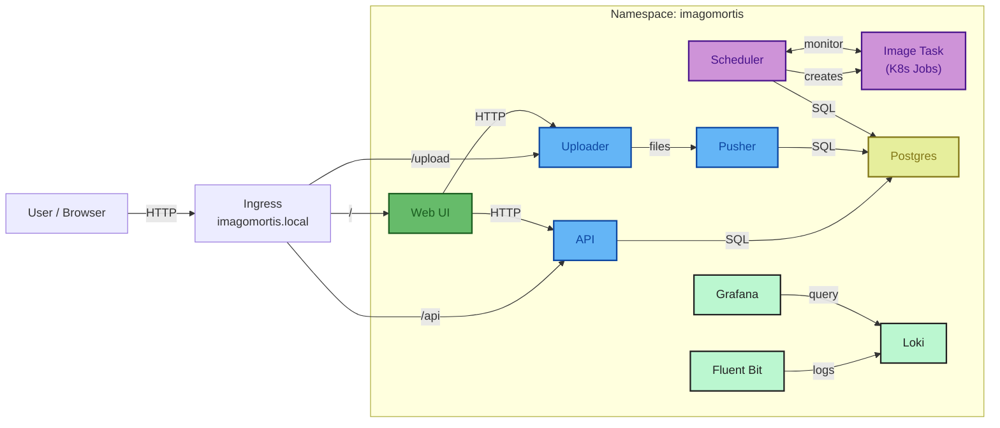

# ImagoMortis

## Components



### Modules

#### Uploader

The uploader, located in the [uploader](uploader) directory, is responsible for handling image uploads from users. It provides a simple and intuitive interface for selecting and uploading images to the server. It uploads images in a temporary folder with unique UUIDs to avoid filename conflicts.

#### Pusher

The pusher, located in the [pusher](pusher) directory, processes the uploaded images. It retrieves images from the temporary upload folder, uploads a related entry into the database (with also binary data), and deletes the temporary files after processing. The pusher ensures that images are properly stored and managed within the system.

#### Scheduler

The scheduler, located in the [scheduler](scheduler) directory, polls the database for pending image processing tasks and dynamically creates Kubernetes Jobs to handle them. It uses the Kubernetes API to spawn Image Task jobs, monitors their progress, and updates the database with the results. The scheduler runs continuously and ensures efficient parallel processing of images.

#### Image Task

The image task, located in the [image_task](image_task) directory, is a worker that processes individual images. It is spawned as a Kubernetes Job by the Scheduler. Each task loads an image, applies processing (e.g., drawing random circles), and saves the result. Image Tasks share a volume with the Scheduler for input/output file exchange.

#### API

The API, located in the [api](api) directory, provides endpoints for accessing and managing the images stored in the database. It allows users to retrieve image metadata, download images, and perform other operations related to image management. The API is designed to be RESTful and easy to use.

#### Web UI

The Web UI, located in the [webui](webui) directory, offers a user-friendly interface for interacting with the microservices, like: Upload images, view/download/edit/delete existing images, etc. It is built using modern web technologies to ensure a responsive and engaging user experience.


## Development


**TLDR**: Up the cluster with:

```bash
kubectl apply -f k8s/
```

After deployment, access the services via NodePort:

- **Web UI**: http://localhost:30080
- **API**: http://localhost:30081
- **Uploader**: http://localhost:30082


Expose GRAFANA and LOKI services with port-forwarding:

```bash
kubectl port-forward svc/grafana 3000:80 -n imagomortis
```

### Kubernetes Configuraiton

See the [k8s](k8s) directory for Kubernetes manifests and configurations.

### Tips & Tricks

After component rebuild, you can restart the related pod with:

```bash
kubectl rollout restart deployment/<component-name> -n imagomortis
```