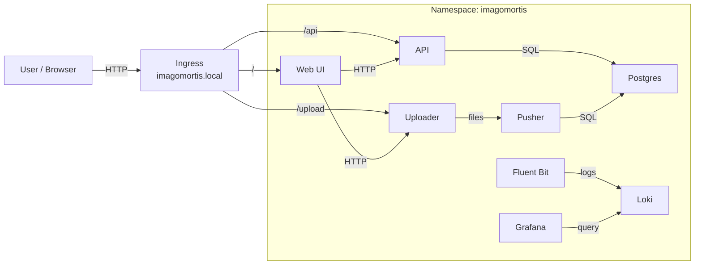

# ImagoMortis

## Components




### Uploader

The uploader, located in the [uploader](uploader) directory, is responsible for handling image uploads from users. It provides a simple and intuitive interface for selecting and uploading images to the server. It uploads images
in a temporary folder with unique UUIDs to avoid filename conflicts.

### Pusher

The pusher, located in the [pusher](pusher) directory, processes the uploaded images. It retrieves images from the temporary upload folder, upload a related entry into the database (with also binary data), and delete the temporary files after processing. The pusher ensures that images are properly stored and managed within the system.

### API

The API, located in the [api](api) directory, provides endpoints for accessing and managing the images stored in the database. It allows users to retrieve image metadata, download images, and perform other operations related to image management. The API is designed to be RESTful and easy to use.

### Web UI

The Web UI, located in the [webui](webui) directory, offers a user-friendly interface for interacting with the microservices, like: Upload images, view/download/edit/delete existing images, etc. It is built using modern web technologies to ensure a responsive and engaging user experience.


## Development

Up the cluster with:

```bash
kubectl apply -f k8s/
```

WEBUI should be ready on: `http://localhost:30080/`


Expose GRAFANA and LOKI services with port-forwarding:

```bash
kubectl port-forward svc/grafana 3000:80 -n imagomortis
```